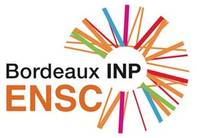

# Deep Learning introductory course

[Ecole Nationale Supérieure de Cognitique](https://ensc.bordeaux-inp.fr)

## Lecture/Demos

- [Machine Learning In Action](https://colab.research.google.com/github/bpesquet/machine-learning-handbook/blob/master/notebooks/workflow/ml_in_action.ipynb)
- [Machine Learning Fundamentals](https://colab.research.google.com/github/bpesquet/machine-learning-handbook/blob/master/notebooks/workflow/ml_fundamentals.ipynb)
- [Artificial Neural Networks](https://colab.research.google.com/github/bpesquet/machine-learning-handbook/blob/master/notebooks/models/neural_networks.ipynb)
- [Convolutional Neural Networks](https://colab.research.google.com/github/bpesquet/machine-learning-handbook/blob/master/notebooks/models/cnn.ipynb)

## Practicals

- [Classify Fashion Items](https://colab.research.google.com/github/bpesquet/machine-learning-katas/blob/master/notebooks/training_models/fashion_mnist.ipynb)
- [Classify Common Images](https://colab.research.google.com/github/bpesquet/machine-learning-katas/blob/master/notebooks/training_models/fashion_mnist.ipynb)
- [Distinguish Dogs vs. Cats](https://colab.research.google.com/github/bpesquet/machine-learning-katas/blob/master/notebooks/training_models/fashion_mnist.ipynb)
